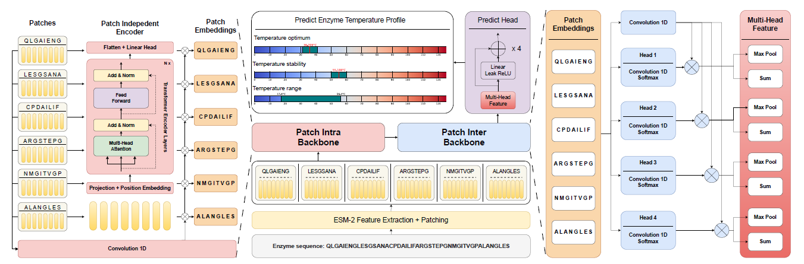

# Model enzyme temperature stability from sequence segment perspective



**PatchET** is a deep learning model designed to predict enzyme enzyme temperature properties.

---

## 🔧 Setup

### 1. Install dependencies
```bash
pip install -r requirements.txt
 ```

### 2. Download ESM-2 Weights
- Download [ESM-2 weights](https://huggingface.co/facebook/esm2_t30_150M_UR50D).
- Place the downloaded files in the `esm150/` folder.

---

## 🏋️ Training

Train the model for each task using the appropriate config file:

Temperature optimum
```bash
python train.py \
--run_config run_configs/divide_clusters/opt.yaml \
--model_config model_configs/PatchET.yaml
 ```


Temperature stability
```bash
python train.py \
--run_config run_configs/divide_clusters/stability.yaml \
--model_config model_configs/PatchET.yaml
 ```


Temperature range
```bash
python train.py \
--run_config run_configs/divide_clusters/range.yaml \
--model_config model_configs/PatchET_range.yaml
 ```