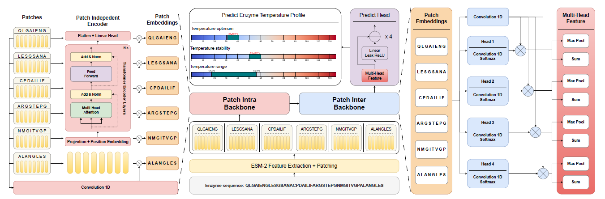

# PatchET: Learning Enzyme Temperature Properties through Patch-based Neural Architectures



**PatchET** is a deep learning model designed to predict enzyme temperature properties:

| Task | Description | Output columns |
|------|-------------|----------------|
| `opt` | Temperature Optimum | `topt` |
| `stability` | Temperature Stability | `t_stability` |
| `range` | Temperature Range | `t_low`, `t_high` |

---

## 🔧 Setup

### 1. Install dependencies

```bash
pip install -r requirements.txt
```

### 2. Download ESM-2 weights

Download the [ESM-2 (esm2_t30_150M_UR50D)](https://huggingface.co/facebook/esm2_t30_150M_UR50D) pretrained weights and place all files in the `esm150/` folder so that the directory looks like this:

```
esm150/
├── config.json
├── model.safetensors
├── special_tokens_map.json
├── tokenizer_config.json
└── vocab.txt
```

### 3. Download PatchET model weights

Download the [PatchET model weights](https://doi.org/10.5281/zenodo.18408368) and place the checkpoint files into the `checkpoint/` folder. Each task has its own subfolder containing a model config and weights file:

```
checkpoint/
├── opt/
│   ├── model_config.yaml
│   └── model.safetensors
├── range/
│   ├── model_config.yaml
│   └── model.safetensors
└── stability/
    ├── model_config.yaml
    └── model.safetensors
```

---

## 🏋️ Training

Train the model for each task using the appropriate config file:

**Temperature optimum**
```bash
python train.py \
  --run_config run_configs/opt.yaml \
  --model_config model_configs/PatchET.yaml
```

**Temperature stability**
```bash
python train.py \
  --run_config run_configs/stability.yaml \
  --model_config model_configs/PatchET.yaml
```

**Temperature range**
```bash
python train.py \
  --run_config run_configs/range.yaml \
  --model_config model_configs/PatchET_range.yaml
```

---

## 🔬 Inference

Use `inference.py` to predict enzyme temperature properties from a FASTA file.
Example FASTA files for each task are provided in the `examples/` directory.

### Basic usage

```bash
python inference.py --fasta <input.fasta> [--tasks TASK ...] [--output OUTPUT] [--batch_size N] [--device DEVICE]
```

| Argument | Description | Default |
|----------|-------------|---------|
| `--fasta` | Path to the input FASTA file (required) | — |
| `--tasks` | Task(s) to run: `opt`, `stability`, `range` | `opt` |
| `--output` | Path to the output CSV file | `predictions.csv` |
| `--batch_size` | Batch size for inference | `16` |
| `--device` | Device to use: `auto`, `cpu`, `cuda` | `auto` |

### Predict Temperature Optimum

```bash
python inference.py --fasta examples/Topt_example.fasta --tasks opt --output topt_predictions.csv
```

### Predict Temperature Stability

```bash
python inference.py --fasta examples/Stability_example.fasta --tasks stability --output stability_predictions.csv
```

### Predict Temperature Range

```bash
python inference.py --fasta examples/Range_example.fasta --tasks range --output range_predictions.csv
```

### Predict all three properties at once

```bash
python inference.py --fasta examples/Topt_example.fasta --tasks opt stability range --output all_predictions.csv
```

### Output format

The output CSV contains the following columns:

| Column | Description |
|--------|-------------|
| `accession` | UniProt accession parsed from the FASTA header |
| `sequence` | Input protein sequence |
| `topt` | Predicted optimal temperature (if `opt` task is run) |
| `t_stability` | Predicted thermostability (if `stability` task is run) |
| `t_low` | Predicted lower bound of active range (if `range` task is run) |
| `t_high` | Predicted upper bound of active range (if `range` task is run) |

---

## 📄 Citation

If you find PatchET useful in your research, please cite our paper:

```bibtex
@article{Zhang_Yang_Cao_Deng_2026,
  title     = {PatchET: Learning Enzyme Temperature Properties Through Patch-Based Neural Architectures},
  volume    = {40},
  url       = {https://ojs.aaai.org/index.php/AAAI/article/view/40099},
  DOI       = {10.1609/aaai.v40i34.40099},
  number    = {34},
  journal   = {Proceedings of the AAAI Conference on Artificial Intelligence},
  author    = {Zhang, Ziqi and Yang, Runze and Cao, Longbing and Deng, Zhaohong},
  year      = {2026},
  month     = {Mar.},
  pages     = {28671--28679}
}
```

