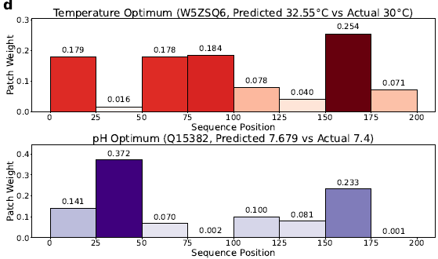

# PatchET: Learning Enzyme Temperature Properties through Patch-based Neural Architecture


## Overview

**PatchET** is a patch-based deep learning model for predicting enzyme temperature properties. 

| Task | Description | Output column(s) | Model |
|------|-------------|------------------|-------|
| `opt` | Temperature Optimum | `topt` | PatchET, PatchEX |
| `stability` | Temperature Stability | `t_stability` | PatchET |
| `range` | Temperature Range | `t_low`, `t_high` | PatchET |
| `ph` | Optimal pH | `phopt` | PatchEX |

---

## Updates
**PatchEX** is an upgraded successor that delivers both higher accuracy and built-in interpretability through an attention-based per-patch prediction head and a joint training objective. PatchEX produces per-residue importance weights alongside each prediction, revealing which sequence regions drive the predicted property value.

## 📊 Performance

### Temperature Optimum

PatchEX achieves the best performance among all compared methods on temperature optimum prediction, reducing MAE from **9.69** (PatchET) to **8.96** and improving Pearson correlation from **0.55** to **0.59**.

| Model | MAE ↓ | Pearson r ↑ |
|-------|--------|-------------|
| Bi-LSTM | 12.18 | 0.45 |
| CNN | 11.68 | 0.51 |
| Transformer | 12.38 | 0.52 |
| LightAttention | 11.59 | 0.52 |
| RNN | 11.79 | 0.46 |
| DeepET | 11.59 | 0.45 |
| Seq2-Topt | 11.79 | 0.53 |
| TemStaPro | 9.69 | 0.50 |
| PatchET | 9.69 | 0.55 |
| **PatchEX** | **8.96** | **0.59** |

### Optimal pH

PatchEX outperforms all compared methods on optimal pH prediction across RMSE, MAE, and R².

| Model | RMSE ↓ | MAE ↓ | R² ↑ |
|-------|---------|--------|-------|
| EpHod | 0.89 | 0.65 | 0.39 |
| Seq2-pHopt | 0.88 | 0.64 | 0.42 |
| **PatchEX** | **0.83** | **0.58** | **0.48** |

### Explainability

In addition to accurate predictions, PatchEX outputs per-patch contribution weights that identify which 25-residue segments most strongly influence the predicted value. The figure below shows patch weights for a representative temperature optimum example (W5ZSQ6, predicted 32.55 °C vs. actual 30 °C) and a pH optimum example (Q15382, predicted 7.679 vs. actual 7.4).



> Panel (d): bar height corresponds to patch weight at each sequence position. Higher bars indicate regions with greater influence on the predicted property, allowing researchers to pinpoint functionally important sequence regions without additional experiments.

---

## 🔧 Setup

### 1. Install dependencies

```bash
pip install -r requirements.txt
```

### 2. Download ESM-2 weights

Download the [ESM-2 (esm2_t30_150M_UR50D)](https://huggingface.co/facebook/esm2_t30_150M_UR50D) pretrained weights and place all files in the `esm150/` folder:

```
esm150/
├── config.json
├── model.safetensors
├── special_tokens_map.json
├── tokenizer_config.json
└── vocab.txt
```

### 3. Download model weights

Download the [model weights](https://doi.org/10.5281/zenodo.19757023) and place the checkpoint files under the `checkpoint/` folder:

```
checkpoint/
├── PatchET/
│   ├── opt/
│   │   ├── model_config.yaml
│   │   └── model.safetensors
│   ├── range/
│   │   ├── model_config.yaml
│   │   └── model.safetensors
│   └── stability/
│       ├── model_config.yaml
│       └── model.safetensors
└── PatchEX/
    ├── opt/
    │   ├── model_config.yaml
    │   └── model.safetensors
    └── ph/
        ├── model_config.yaml
        └── model.safetensors
```

---

## 🏋️ Training

Train the model for each task using the appropriate config file:

**Temperature optimum**
```bash
python train.py \
  --run_config run_configs/opt.yaml \
  --model_config model_configs/PatchET.yaml
```

**Temperature stability**
```bash
python train.py \
  --run_config run_configs/stability.yaml \
  --model_config model_configs/PatchET.yaml
```

**Temperature range**
```bash
python train.py \
  --run_config run_configs/range.yaml \
  --model_config model_configs/PatchET_range.yaml
```

---

## 🔬 Inference

Use `inference.py` to predict enzyme properties from a FASTA file. Example FASTA files are provided in the `examples/` directory.

### Arguments

```bash
python inference.py --fasta <input.fasta> [OPTIONS]
```

| Argument | Description | Default |
|----------|-------------|---------|
| `--fasta` | Path to the input FASTA file (required) | — |
| `--model` | Model backend: `patchet` or `patchex` | `patchet` |
| `--tasks` | Task(s) to run: `opt`, `stability`, `range`, `ph` | `opt` |
| `--output` | Path to the output CSV file | `predictions.csv` |
| `--batch_size` | Batch size for inference | `16` |
| `--device` | Device to use: `auto`, `cpu`, `cuda` | `auto` |
| `--weights_output` | Directory to save per-residue weight files (PatchEX only) | — |

---

### PatchET inference

PatchET supports `opt`, `stability`, and `range`. You can run one or more tasks in a single call.

**Predict Temperature Optimum**
```bash
python inference.py \
  --fasta examples/Topt_example.fasta \
  --tasks opt \
  --output topt_predictions.csv
```

**Predict Temperature Stability**
```bash
python inference.py \
  --fasta examples/Stability_example.fasta \
  --tasks stability \
  --output stability_predictions.csv
```

**Predict Temperature Range**
```bash
python inference.py \
  --fasta examples/Range_example.fasta \
  --tasks range \
  --output range_predictions.csv
```

**Predict all three properties at once**
```bash
python inference.py \
  --fasta examples/Topt_example.fasta \
  --tasks opt stability range \
  --output all_predictions.csv
```

---

### PatchEX inference

Pass `--model patchex` to use PatchEX. It supports `opt` and `ph`, and outputs per-residue importance weights for interpretability. Tasks not available in PatchEX (`stability`, `range`) fall back to PatchET automatically. Tasks exclusive to PatchEX (`ph`) will raise an error if `--model patchet` is used.

**Predict Temperature Optimum**
```bash
python inference.py \
  --fasta examples/Topt_example.fasta \
  --model patchex \
  --tasks opt \
  --output topt_patchex.csv \
  --weights_output weights/
```

**Predict Optimal pH**
```bash
python inference.py \
  --fasta examples/Topt_example.fasta \
  --model patchex \
  --tasks ph \
  --output ph_predictions.csv \
  --weights_output weights/
```

**Predict Topt and Optimal pH together**
```bash
python inference.py \
  --fasta examples/Topt_example.fasta \
  --model patchex \
  --tasks opt ph \
  --output patchex_predictions.csv \
  --weights_output weights/
```

**Mix PatchEX (opt, ph) with PatchET (stability, range)**
```bash
python inference.py \
  --fasta examples/Topt_example.fasta \
  --model patchex \
  --tasks opt ph stability range \
  --output all_predictions.csv \
  --weights_output weights/
```

**Embed weights in the CSV instead of separate files**

If `--weights_output` is omitted, per-residue weights are added as semicolon-separated columns in the output CSV.

```bash
python inference.py \
  --fasta examples/Topt_example.fasta \
  --model patchex \
  --tasks opt ph \
  --output patchex_predictions.csv
```

---

### Output format

**Prediction CSV** — always produced:

| Column | Description |
|--------|-------------|
| `accession` | UniProt accession parsed from the FASTA header |
| `sequence` | Input protein sequence |
| `topt` | Predicted optimal temperature in °C (if `opt` task is run) |
| `t_stability` | Predicted thermostability in °C (if `stability` task is run) |
| `t_low` | Predicted lower bound of active temperature range (if `range` task is run) |
| `t_high` | Predicted upper bound of active temperature range (if `range` task is run) |
| `phopt` | Predicted optimal pH (if `ph` task is run) |
| `topt_residue_weights` | Per-residue importance weights, semicolon-separated (PatchEX `opt`, when `--weights_output` is not set) |
| `phopt_residue_weights` | Per-residue importance weights, semicolon-separated (PatchEX `ph`, when `--weights_output` is not set) |

**Per-residue weight JSON** — produced when `--weights_output` is set (PatchEX only):

One file per sequence at `<weights_output>/<task>/<accession>.json`:

```json
{
  "accession": "P12345",
  "sequence": "MKTIIALSYIFCLVFA...",
  "predicted_value": 62.3,
  "residue_weights": [0.012, 0.015, 0.009, ...],
  "patch_weights":   [0.031, 0.044, 0.028, ...]
}
```

| Field | Description |
|-------|-------------|
| `predicted_value` | Predicted property value (Topt in °C, or pH) |
| `residue_weights` | Per-residue importance score, length equals sequence length |
| `patch_weights` | One aggregated score per 25-residue patch |

Higher weights indicate patches and their constituent residues that contribute more strongly to the predicted value.

---

## 📄 Citation

If you find PatchET or PatchEX useful in your research, please cite our paper:

```bibtex
@article{Zhang_Yang_Cao_Deng_2026,
  title     = {PatchET: Learning Enzyme Temperature Properties Through Patch-Based Neural Architectures},
  volume    = {40},
  url       = {https://ojs.aaai.org/index.php/AAAI/article/view/40099},
  DOI       = {10.1609/aaai.v40i34.40099},
  number    = {34},
  journal   = {Proceedings of the AAAI Conference on Artificial Intelligence},
  author    = {Zhang, Ziqi and Yang, Runze and Cao, Longbing and Deng, Zhaohong},
  year      = {2026},
  month     = {Mar.},
  pages     = {28671--28679}
}
```